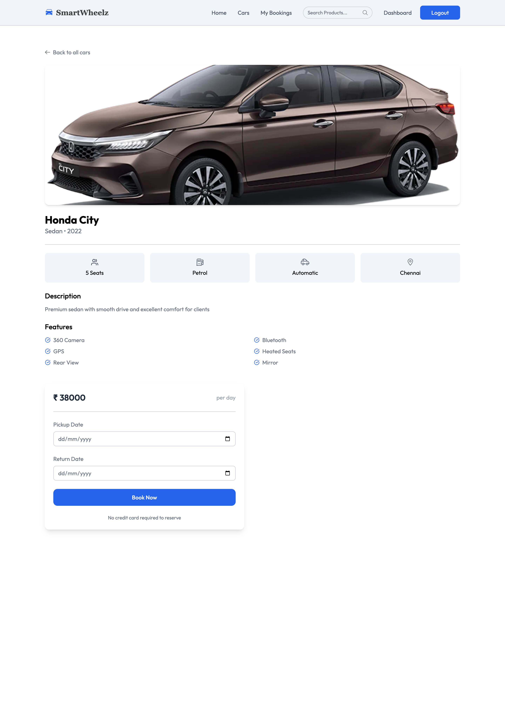
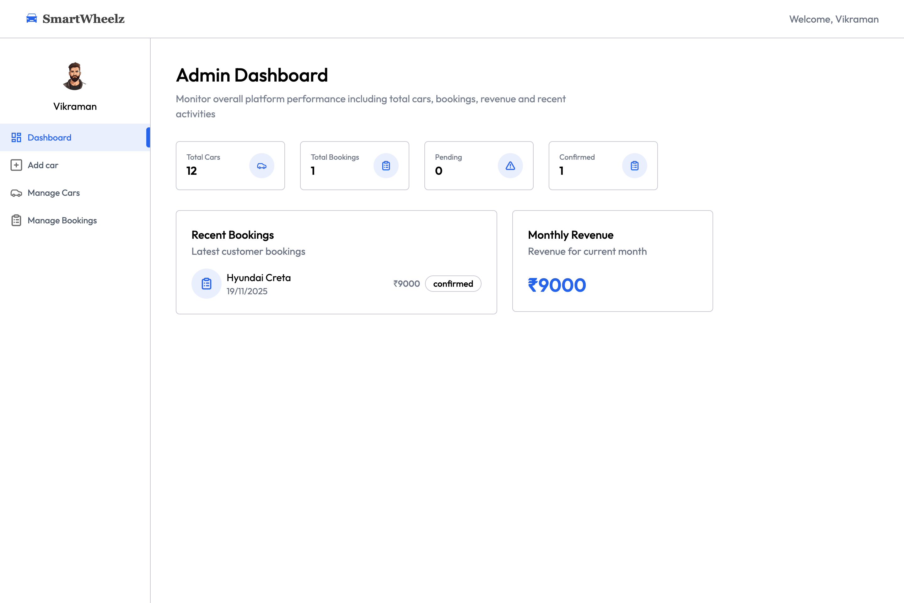
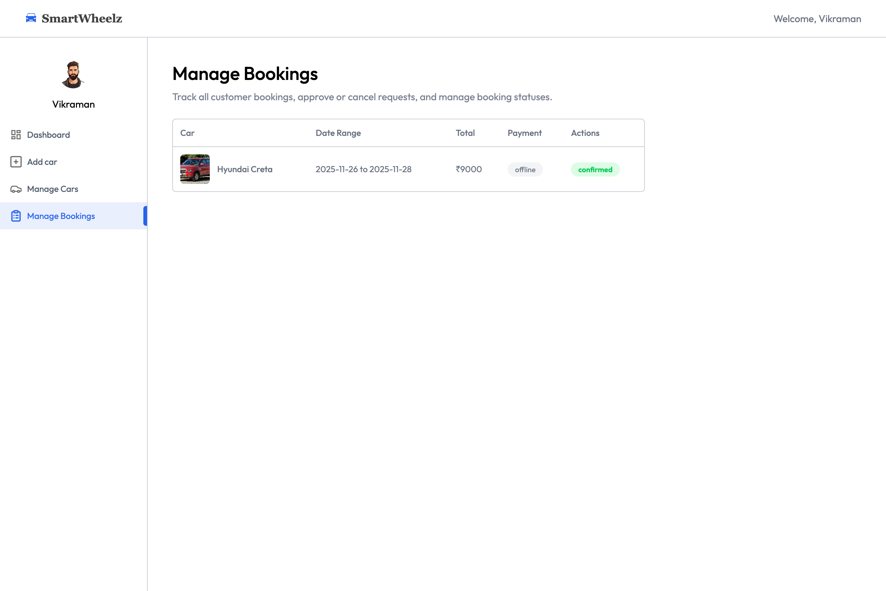
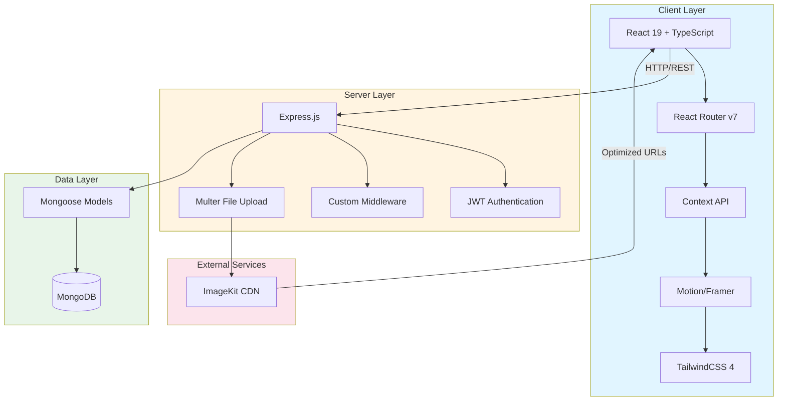
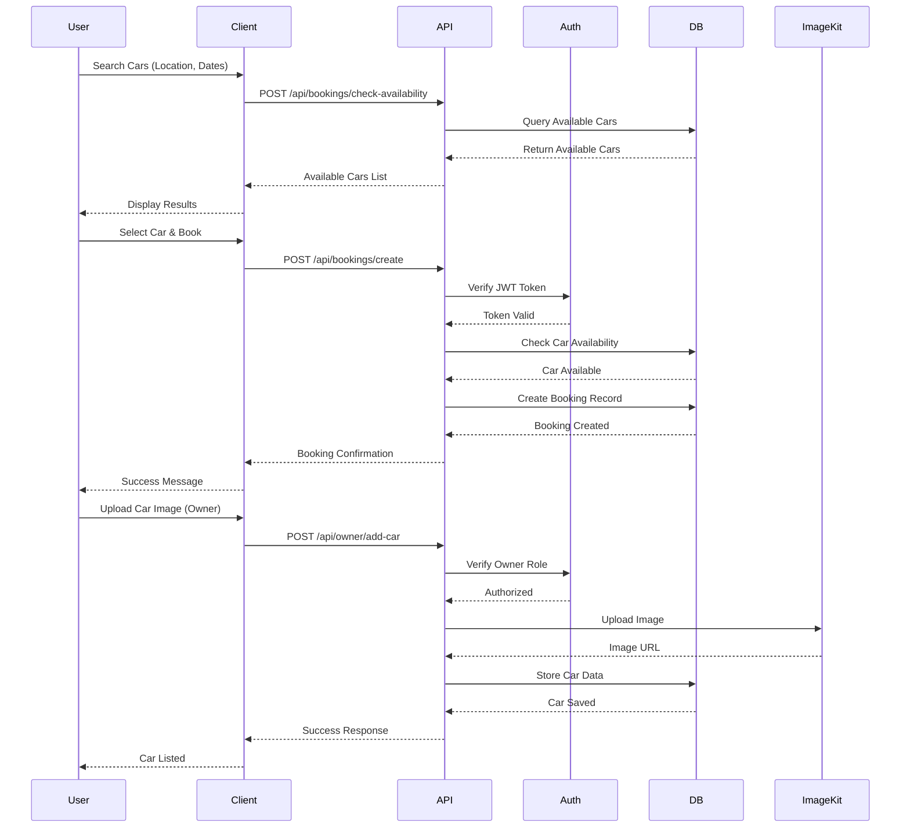
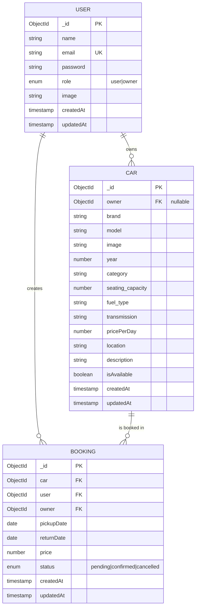
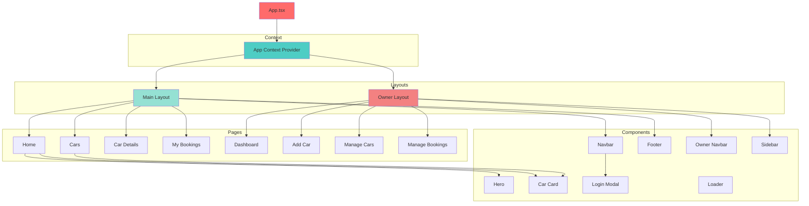
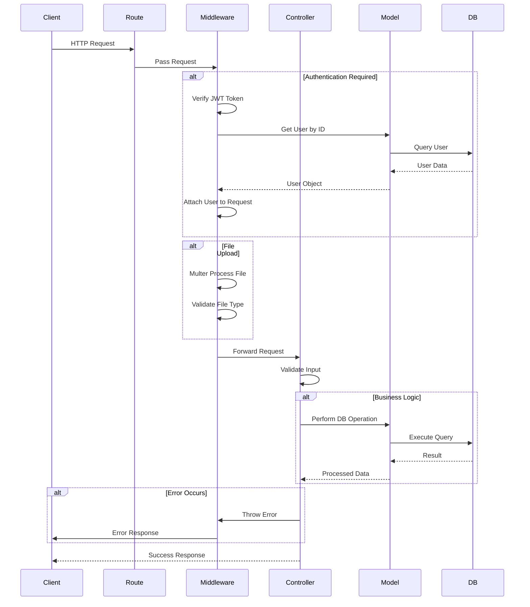

# 🚗 SmartWheelz - Premium Car Rental Platform

[](https://www.typescriptlang.org/)
[](https://reactjs.org/)
[](https://nodejs.org/)
[](https://www.mongodb.com/)
[](https://expressjs.com/)

A full-stack, production-ready car rental platform built with the MERN stack, featuring real-time booking management, role-based access control, and seamless payment integration.

## 🌐 Live Deployment

- **Frontend:** [https://smartwheelz-frontend.onrender.com](https://smartwheelz-frontend.onrender.com)
- **Backend API:** [https://smartwheelz.onrender.com](https://smartwheelz.onrender.com)

## 📸 Screenshots

<div align="center">

### Landing Page


### Car Listing


### Car Details & Booking



### Owner Dashboard



### Booking Management



</div>

## ✨ Key Features

### 👤 User Features

- **Advanced Search & Filtering** - Search cars by brand, model, category, transmission type, and location
- **Date-Based Availability** - Real-time availability checking for specific date ranges
- **Seamless Booking** - Intuitive booking flow with instant confirmation
- **Booking History** - Track all past and upcoming bookings with detailed information
- **Secure Authentication** - JWT-based authentication with role-based access control

### 👨‍💼 Owner Features

- **Car Management** - Add, edit, toggle availability, archive, and delete cars
- **Booking Oversight** - View and manage all bookings (approve, cancel, confirm)
- **Analytics Dashboard** - Real-time metrics including revenue, bookings, and car performance
- **Image Management** - Integrated ImageKit for optimized image storage and delivery
- **Role Switching** - Seamless transition between user and owner roles

### 🔧 Technical Features

- **Responsive Design** - Mobile-first approach with TailwindCSS
- **Smooth Animations** - Motion/Framer Motion for enhanced UX
- **Image Optimization** - ImageKit integration for fast image delivery
- **Error Handling** - Comprehensive error handling on both client and server
- **Type Safety** - Full TypeScript implementation across the stack
- **Code Quality** - ESLint + Prettier for consistent code formatting

## 🏗️ System Architecture



## 🔄 Data Flow Diagram



## 🗄️ Database Schema



## 🎨 Component Architecture



## 🔌 API Request Flow



## 🛠️ Tech Stack

### Frontend

- **React 19** - Latest React with improved performance
- **TypeScript** - Type-safe code
- **Vite** - Lightning-fast build tool
- **TailwindCSS 4** - Utility-first CSS framework
- **Motion (Framer Motion)** - Smooth animations
- **React Router v7** - Client-side routing
- **Axios** - HTTP client
- **React Hot Toast** - Toast notifications

### Backend

- **Node.js** - JavaScript runtime
- **Express.js** - Web framework
- **TypeScript** - Type safety on the server
- **MongoDB** - NoSQL database
- **Mongoose** - MongoDB ODM
- **JWT** - Authentication tokens
- **bcryptjs** - Password hashing
- **Multer** - File upload handling
- **ImageKit** - Image optimization & CDN

### DevOps & Tools

- **ESLint** - Code linting
- **Prettier** - Code formatting
- **pnpm** - Fast package manager
- **Git** - Version control
- **Vercel/Render** - Deployment platforms

## 📁 Project Structure

```
smartwheelz/
├── client/                 # Frontend React application
│   ├── public/
│   │   └── screenshots/   # Application screenshots
│   ├── src/
│   │   ├── assets/        # Static assets (images, icons)
│   │   ├── components/    # Reusable components
│   │   │   └── owner/     # Owner-specific components
│   │   ├── context/       # React Context (Global State)
│   │   ├── pages/         # Page components
│   │   │   └── owner/     # Owner dashboard pages
│   │   ├── types/         # TypeScript type definitions
│   │   ├── utils/         # Utility functions
│   │   ├── App.tsx        # Main app component
│   │   └── main.tsx       # Application entry point
│   ├── package.json
│   └── vite.config.ts
│
├── server/                # Backend Express application
│   ├── src/
│   │   ├── configs/       # Configuration files
│   │   │   ├── db.ts          # MongoDB connection
│   │   │   ├── imageKit.ts    # ImageKit setup
│   │   │   ├── session.ts     # Session configuration
│   │   │   └── validateEnv.ts # Environment validation
│   │   ├── controllers/   # Request handlers
│   │   │   ├── bookingController.ts
│   │   │   ├── ownerController.ts
│   │   │   └── userController.ts
│   │   ├── middleware/    # Custom middleware
│   │   │   ├── asyncHandler.ts # Async error wrapper
│   │   │   ├── auth.ts         # JWT authentication
│   │   │   ├── errorHandler.ts # Error handling
│   │   │   └── multer.ts       # File upload
│   │   ├── models/        # Mongoose schemas
│   │   │   ├── Booking.ts
│   │   │   ├── Car.ts
│   │   │   └── User.ts
│   │   ├── routes/        # API routes
│   │   │   ├── bookingRoutes.ts
│   │   │   ├── ownerRoutes.ts
│   │   │   └── userRoutes.ts
│   │   ├── types/         # TypeScript types
│   │   └── server.ts      # Express server setup
│   ├── package.json
│   └── tsconfig.json
│
└── README.md
```

## 🚀 Getting Started

### Prerequisites

- Node.js (v18 or higher)
- pnpm (v8 or higher)
- MongoDB (local or Atlas)
- ImageKit account

### Installation

1. **Clone the repository**

```bash
git clone https://github.com/yourusername/smartwheelz.git
cd smartwheelz
```

2. **Install dependencies**

```bash
# Install server dependencies
cd server
pnpm install

# Install client dependencies
cd ../client
pnpm install
```

3. **Environment Setup**

Create `.env` file in the `server` directory:

```env
PORT=5000
MONGO_URI=mongodb://localhost:27017/smartwheelz
JWT_SECRET=your_jwt_secret_here
CLIENT_URL=http://localhost:5173

IMAGEKIT_PUBLIC_KEY=your_public_key
IMAGEKIT_PRIVATE_KEY=your_private_key
IMAGEKIT_URL_ENDPOINT=https://ik.imagekit.io/your_folder
```

Create `.env` file in the `client` directory:

```env
VITE_BASE_URL=http://localhost:5000
VITE_CURRENCY=₹
```

4. **Run the application**

```bash
# Terminal 1 - Run server
cd server
pnpm dev

# Terminal 2 - Run client
cd client
pnpm dev
```

The application will be available at:

- Frontend: `http://localhost:5173`
- Backend: `http://localhost:5000`

## 📝 API Documentation

### User Endpoints

| Method | Endpoint             | Description       | Auth Required |
| ------ | -------------------- | ----------------- | ------------- |
| POST   | `/api/user/register` | Register new user | No            |
| POST   | `/api/user/login`    | User login        | No            |
| GET    | `/api/user/data`     | Get user data     | Yes           |
| GET    | `/api/user/cars`     | Get all cars      | No            |

### Owner Endpoints

| Method | Endpoint                    | Description             | Auth Required |
| ------ | --------------------------- | ----------------------- | ------------- |
| POST   | `/api/owner/change-role`    | Change user to owner    | Yes           |
| POST   | `/api/owner/add-car`        | Add new car             | Yes (Owner)   |
| GET    | `/api/owner/cars`           | Get owner's cars        | Yes (Owner)   |
| POST   | `/api/owner/toggle-car`     | Toggle car availability | Yes (Owner)   |
| POST   | `/api/owner/delete-car`     | Soft delete car         | Yes (Owner)   |
| DELETE | `/api/owner/delete-car/:id` | Permanently delete car  | Yes (Owner)   |
| GET    | `/api/owner/dashboard`      | Get dashboard data      | Yes (Owner)   |
| POST   | `/api/owner/update-image`   | Update profile image    | Yes (Owner)   |

### Booking Endpoints

| Method | Endpoint                           | Description            | Auth Required |
| ------ | ---------------------------------- | ---------------------- | ------------- |
| POST   | `/api/bookings/check-availability` | Check car availability | No            |
| POST   | `/api/bookings/create`             | Create new booking     | Yes           |
| GET    | `/api/bookings/user`               | Get user's bookings    | Yes           |
| GET    | `/api/bookings/owner`              | Get owner's bookings   | Yes (Owner)   |
| POST   | `/api/bookings/change-status`      | Update booking status  | Yes (Owner)   |

## 🔐 Security Features

- **JWT Authentication** - Secure token-based authentication
- **Password Hashing** - bcrypt for password encryption
- **Input Validation** - Server-side validation for all inputs
- **CORS Protection** - Configured CORS for trusted origins
- **File Upload Validation** - Strict file type and size checks
- **Role-Based Access** - Middleware to protect owner-only routes
- **Error Sanitization** - Generic error messages to prevent information leakage

## 📄 License

This project is licensed under the MIT License.

## 👨‍💻 Author

**Vikraman**

- GitHub: [@VIKRAMANR7](https://github.com/VIKRAMANR7)

## 🙏 Acknowledgments

- MongoDB for the robust database solution
- ImageKit for seamless image optimization
- The React and Node.js communities for excellent documentation

---

<div align="center">

**Built with ❤️ using the MERN Stack**

If you found this project helpful, please consider giving it a ⭐!

</div>
