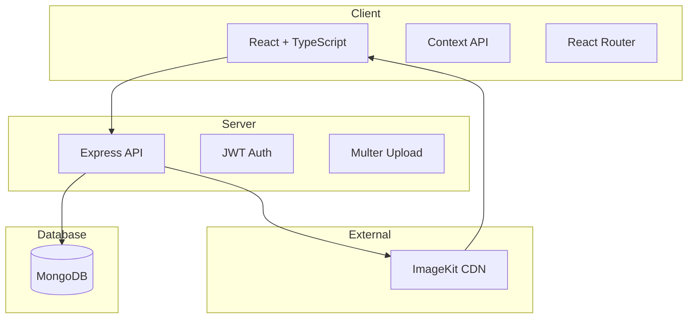
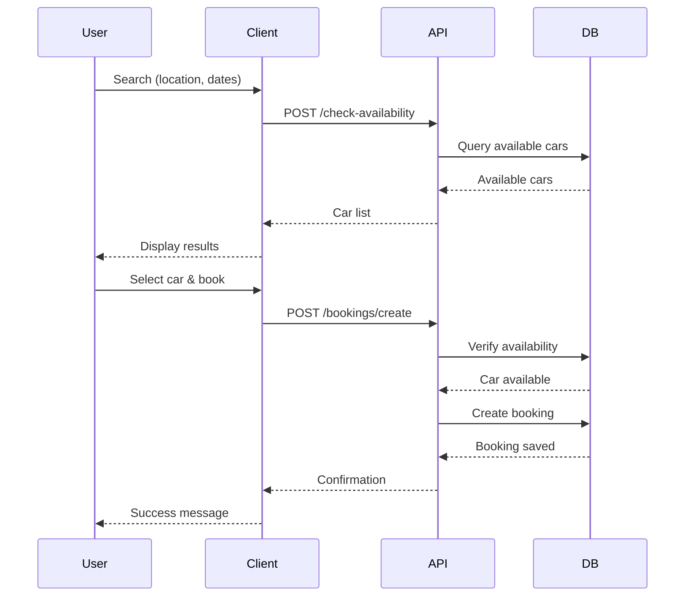
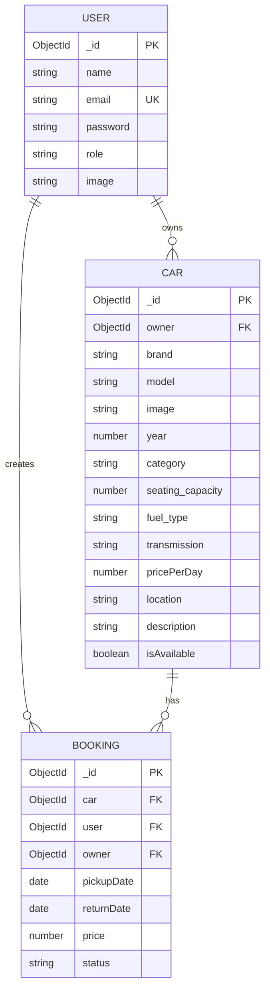

# SmartWheelz

A full-stack car rental platform with booking management, owner dashboard, and JWT authentication.

## Live Demo

- Frontend: https://smartwheelz-frontend.onrender.com
- Backend: https://smartwheelz.onrender.com

## Tech Stack

**Frontend:** React, TypeScript, Vite, TailwindCSS, React Router, Motion, Axios

**Backend:** Node.js, Express, TypeScript, MongoDB, Mongoose, JWT, ImageKit

## Features

- Browse and search cars by brand, model, category, and location
- Date-based availability checking
- User authentication with JWT
- Booking management for users
- Owner dashboard with analytics
- Car management (add, edit, toggle availability, delete)
- Image upload with ImageKit optimization
- Role-based access control (user/owner)

## System Architecture



## Booking Flow



## Database Schema



## API Endpoints

### User

| Method | Endpoint           | Description   |
| ------ | ------------------ | ------------- |
| POST   | /api/user/register | Register user |
| POST   | /api/user/login    | Login user    |
| GET    | /api/user/data     | Get user data |
| GET    | /api/user/cars     | Get all cars  |

### Owner

| Method | Endpoint                  | Description          |
| ------ | ------------------------- | -------------------- |
| POST   | /api/owner/change-role    | Become owner         |
| POST   | /api/owner/add-car        | Add car              |
| GET    | /api/owner/cars           | Get owner cars       |
| POST   | /api/owner/toggle-car     | Toggle availability  |
| POST   | /api/owner/delete-car     | Soft delete car      |
| DELETE | /api/owner/delete-car/:id | Permanent delete     |
| GET    | /api/owner/dashboard      | Dashboard data       |
| POST   | /api/owner/update-image   | Update profile image |

### Booking

| Method | Endpoint                         | Description        |
| ------ | -------------------------------- | ------------------ |
| POST   | /api/bookings/check-availability | Check availability |
| POST   | /api/bookings/create             | Create booking     |
| GET    | /api/bookings/user               | User bookings      |
| GET    | /api/bookings/owner              | Owner bookings     |
| POST   | /api/bookings/change-status      | Update status      |

## Getting Started

### Prerequisites

- Node.js 18+
- pnpm
- MongoDB
- ImageKit account

### Installation

```bash
git clone https://github.com/yourusername/smartwheelz.git
cd smartwheelz

cd server && pnpm install
cd ../client && pnpm install
```

### Environment Variables

**Server (.env)**

```
PORT=5000
MONGO_URI=mongodb://localhost:27017/smartwheelz
JWT_SECRET=your_jwt_secret
CLIENT_URL=http://localhost:5173
IMAGEKIT_PUBLIC_KEY=your_public_key
IMAGEKIT_PRIVATE_KEY=your_private_key
IMAGEKIT_URL_ENDPOINT=https://ik.imagekit.io/your_folder
```

**Client (.env)**

```
VITE_BASE_URL=http://localhost:5000
VITE_CURRENCY=₹
```

### Run Development

```bash
cd server && pnpm dev
cd client && pnpm dev
```

## Author

**Vikraman R** - [GitHub](https://github.com/VIKRAMANR7)
